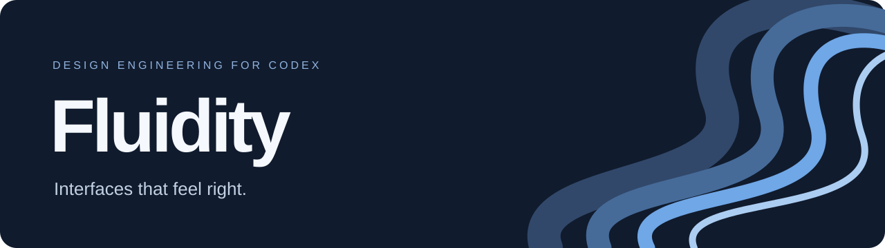
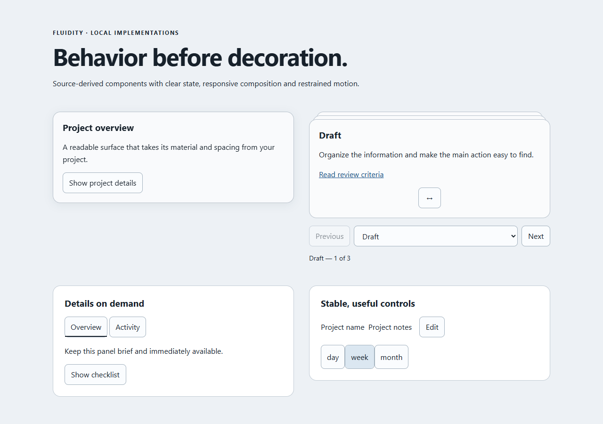

<p align="center">
  
</p>

<p align="center">
  <strong>A design-engineering plugin for Codex.</strong><br />
  Purposeful interfaces. Responsive interactions. Motion with a reason.
</p>

<p align="center">
  <a href="https://github.com/ericxyuan/fluidity/raw/refs/heads/main/dist/fluidity-0.1.0.zip">Download v0.1.0</a>
  &nbsp;·&nbsp;
  <a href="fluidity/README.md">Plugin guide</a>
  &nbsp;·&nbsp;
  <a href="docs/DEVELOPMENT.md">Development</a>
  &nbsp;·&nbsp;
  <a href="LICENSE">MIT license</a>
</p>

---

Fluidity helps Codex build and refine interfaces with clear hierarchy, considered
component choices, and precise interaction behavior. It adapts to your project's
visual identity, from a quiet settings form to a sophisticated card interaction.

The system brings together four cooperating skills, reusable React implementations,
and detailed local recipes. Guidance and implementation assets travel with the plugin,
so ordinary use needs no external catalog, account, or service.

## See it in action



*Working example compositions included in the repository. Their neutral styling is
replaceable with your project's colors, type, spacing, and component conventions.*

## Four skills. One consistent system.

| Skill | What it does |
| --- | --- |
| **[Core](fluidity/skills/fluidity-core/SKILL.md)** | Starts with the user's task, information hierarchy, project conventions, and the smallest useful change. Coordinates the work from implementation through verification. |
| **[Motion](fluidity/skills/fluidity-motion/SKILL.md)** | Chooses when to animate, how motion should respond, and which timing, spring, gesture, or layout technique fits. |
| **[Components](fluidity/skills/fluidity-components/SKILL.md)** | Selects and adapts local controls, cards, disclosures, panels, data patterns, and reusable helpers. |
| **[Review](fluidity/skills/fluidity-review/SKILL.md)** | Finds interaction and design problems, evaluates animation opportunities, and turns requested improvements into verified changes. |

## Designed around the work

- **Your project keeps its identity.** Reuse existing tokens, typography, dependencies,
  and component conventions. Apply only the patterns the task needs.
- **Feedback starts immediately.** Keyboard actions stay direct. Transitions can be
  interrupted, and gestures continue from the current position.
- **Information stays usable.** Preserve readable data, stable selection, meaningful
  labels, and reachable controls instead of adding decoration by default.
- **Preferences are part of the behavior.** Handle reduced motion, reduced transparency,
  contrast, constrained width, and keyboard interaction where applicable.
- **Implementation detail is included.** Local APIs, TypeScript assets, examples,
  state models, and recipes make the behavior concrete.

## Included implementations

The package includes **18 TypeScript/TSX files** across components, hooks, helpers,
and runnable example compositions:

| Area | Included patterns |
| --- | --- |
| Disclosure and panels | Simple disclosure, persistent measured disclosure, direction-aware tabs, presence transitions |
| Selection and feedback | Selected-item indicator, inline editing, controllable state, stable-ID selection, pagination model |
| Presentation | Text reveal, animated numbers, optional pointer tilt |
| Card systems | Apple Glass Card, Stacked Card Set, neutral card composition |
| Supporting utilities | Element measurement, outside-interaction handling, bounded swipe selection |

Additional local recipes cover dialogs, popovers, menus, selectors, sidebars, tables,
shared elements, comparisons, gestures, and specialized application patterns.
Recipe-based patterns use the host project's appropriate primitives; they are clearly
distinguished from the bundled implementations.

### Fluidity concepts

**Viewing Importance** describes what someone needs to understand or act on now.
Primary, supporting, and contextual information can change with the task's state;
importance does not automatically mean larger visuals or more animation.

**Apple Glass Card** is a semantic content surface with a readable material
enhancement, project-controlled styling, and solid preference fallbacks.

**Stacked Card Set** presents a small related collection through bounded selection,
native Previous/Next controls, a labeled selector, and optional handle dragging.
Selection is separate from reordering and modal navigation.

## Get started

Download the [plugin ZIP](https://github.com/ericxyuan/fluidity/raw/refs/heads/main/dist/fluidity-0.1.0.zip),
or clone the complete development repository:

```sh
git clone https://github.com/ericxyuan/fluidity.git
cd fluidity
```

The plugin root is **`fluidity/`**, containing `.codex-plugin/plugin.json` and `skills/`.
The ZIP contains the same plugin root contents without the development workspace.
Use this folder or package with your Codex plugin installation workflow. See the
[official plugin documentation](https://learn.chatgpt.com/docs/plugins) for the
installation and packaging workflows supported by your environment.

Once Fluidity is available, describe the actual task:

> Use Fluidity to improve this settings page. Keep our existing brand and make the
> primary action, error states, and keyboard flow clearer.

> Refine this card interaction with Fluidity. Make it interruptible, preserve focus,
> and support reduced motion.

> Review this interface's motion and implement the changes that matter most for
> frequent use.

The plugin's guidance needs no Node or Python process at runtime. Copied web adapters
target **React 19** and **Motion 12.43-compatible APIs**. Install only the consumer
dependencies needed by the assets you use.

## Develop and verify

From the repository root:

```sh
pnpm install --frozen-lockfile
pnpm typecheck
pnpm test
pnpm build:preview
pnpm exec playwright test
python development/validate.py
python development/test_release_validation.py
python development/package_plugin.py
```

The current validation suite includes **12 browser tests**, strict TypeScript checks,
state-model invariants, automated accessibility scans of representative states, and
standalone package validation. Test coverage and device limitations are documented in
the [validation report](development/VALIDATION.md). The [development guide](docs/DEVELOPMENT.md)
covers prerequisites, previewing components, and rebuilding the archive.

## Repository layout

```text
fluidity/       Distributable plugin: manifest, skills, references and assets
development/    Build utilities, tests, validation, and maintenance records
docs/           Repository documentation and preview assets
dist/           Packaged plugin and SHA-256 file manifest
```

## License

Fluidity is available under the [MIT license](LICENSE).
